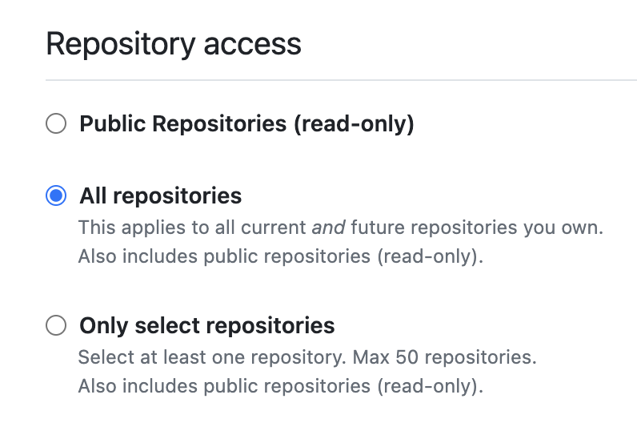
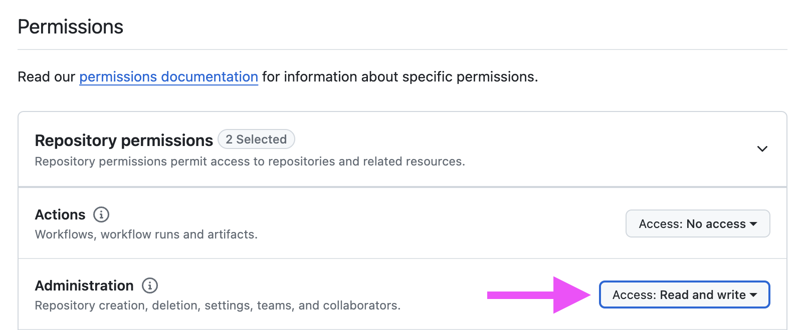

## Running Locally

This application is preconfigured for [DevContainers](https://guides.rubyonrails.org/getting_started_with_devcontainer.html) or you can use a local Ruby install to run it. We like using [Mise](https://mise.jdx.dev/) to install Ruby.

```ruby
# Install dependencies
bundle

# Run Rails
bin/rails server
```

### Create an Admin user

Admin users are able to manage the store and access the admin area for configuration and customer support.

Run `bin/rails sellrepo:admin` to create an admin user and enter your email:

```ruby
bin/rails sellrepo:admin
```

A random password will be generated and printed out. You can change your password after logging in.

### Configure your store

#### GitHub Tokens

Visit https://github.com/settings/personal-access-tokens/new to create a new fine-grained access token

1. Expiration

We recommend 90 days or 1 year expiration. You will need to update this key periodically.

2. Resource owner

Choose the owner of the repositories you'll be selling. If the GitHub organization doesn't show here, enable personal access tokens in the Org settings.

3. Repositories

Select All repositories (recommended) or select the individual repositories you wish to sell. You'll need to generate a new API token to add more repositories if you don't select All repositories.



4. Permissions

Under "Administration" set "Read & Write" access. This is required to add customers to your GitHub repositories.



5. Add the token as `GITHUB_TOKEN` to environment variables or in production Rails credentials with `bin/rails credentials:edit --environment=development`

```yaml
github:
  token: github_pat_1234
```

#### Payments

##### Stripe (Recommended)

To test payments locally, you'll need to provide the Stripe test environment secret key. This can be done in env vars or with Rails credentials.

```bash
STRIPE_PRIVATE_KEY=sk_test_1234 bin/rails server
```

Or with Rails credentials, use environment credentials `bin/rails credentials:edit --environment=development`

```yaml
stripe:
  private_key: sk_test_1234
```

For development, Stripe webhooks can be forwarded to Rails by using the [Stripe CLI](https://docs.stripe.com/stripe-cli). This helps keep local payments data in sync (like if a subscription is canceled or a payment is refunded) to reflect those changes.

```bash
stripe listen --forward-to localhost:3000/webhooks/stripe
```

##### LemonSqueezy (Beta)

> [!WARNING]
> LemonSqueezy support is in beta.

To test payments locally, you'll need to provide the Stripe test environment secret key. This can be done in env vars or with Rails credentials.

```bash
LEMON_SQUEEZY_STORE_ID=1234 LEMON_SQUEEZY_API_KEY=sk_test_1234 bin/rails server
```

Or with Rails credentials, use environment credentials `bin/rails credentials:edit --environment=development`

```yaml
lemon_squeezy:
  store_id: 1234
  api_key: sk_test_1234
```

For development, webhooks can be forwarded to Rails by using [localtunnel](https://theboroer.github.io/localtunnel-www/), ngrok, or a similar tool. This helps keep local payments data in sync (like if a subscription is canceled or a payment is refunded) to reflect those changes.

```bash
lt --port 3000
```
